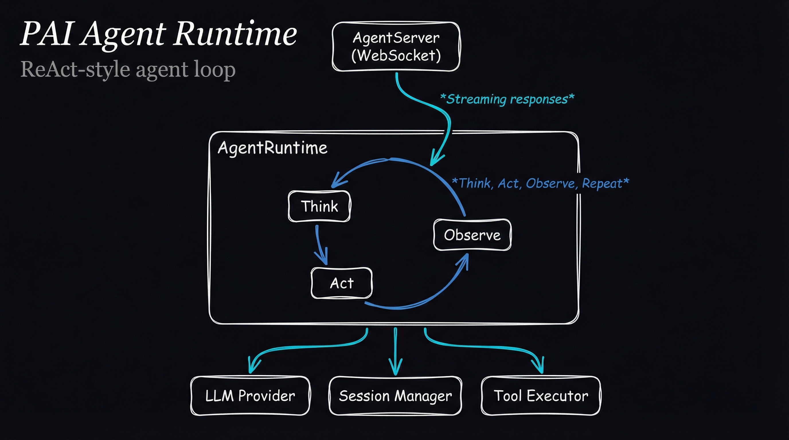

# pai-k8s-agent

Long-running agent runtime for PAI. Implements a ReAct-style agent loop with tool execution, session management, and streaming responses. Despite the name, this pack is deployment-agnostic.

## Architecture



```
┌─────────────────────────────────────────────────────────────┐
│                      AgentServer                             │
│                    (WebSocket API)                           │
│                          │                                   │
│                          ▼                                   │
│  ┌─────────────────────────────────────────────────────┐    │
│  │                   AgentRuntime                       │    │
│  │                                                      │    │
│  │    ┌──────────────────────────────────────────┐     │    │
│  │    │           ReAct Loop                      │     │    │
│  │    │                                          │     │    │
│  │    │   ┌─────┐    ┌─────┐    ┌─────────┐     │     │    │
│  │    │   │Think│───▶│ Act │───▶│ Observe │──┐  │     │    │
│  │    │   └─────┘    └─────┘    └─────────┘  │  │     │    │
│  │    │       ▲                              │  │     │    │
│  │    │       └──────────────────────────────┘  │     │    │
│  │    │                                          │     │    │
│  │    └──────────────────────────────────────────┘     │    │
│  │                          │                           │    │
│  │    ┌─────────────────────┼─────────────────────┐    │    │
│  │    │                     ▼                     │    │    │
│  │    │  ┌──────────┐  ┌──────────┐  ┌────────┐ │    │    │
│  │    │  │   LLM    │  │ Sessions │  │ Tools  │ │    │    │
│  │    │  │ Provider │  │ Manager  │  │Executor│ │    │    │
│  │    │  └──────────┘  └──────────┘  └────────┘ │    │    │
│  │    └─────────────────────────────────────────┘    │    │
│  └─────────────────────────────────────────────────────┘    │
└─────────────────────────────────────────────────────────────┘
```

## Installation

```bash
cd Packs/pai-k8s-agent
bun install
```

## Usage

### Starting the Server

```bash
# With environment variables
PAI_AGENT_PORT=8080 \
VLLM_ENDPOINT=http://localhost:11434/v1 \
USE_OLLAMA=true \
bun run src/server.ts
```

### Programmatic Usage

```typescript
import { AgentServer } from 'pai-k8s-agent';

const server = new AgentServer({ port: 8080 });
await server.start();
```

### WebSocket Client

```typescript
const ws = new WebSocket('ws://localhost:8080');

ws.send(JSON.stringify({
  type: 'query',
  prompt: 'What is the weather today?',
  sessionId: 'optional-session-id',
  effort: 'standard',
}));

ws.onmessage = (event) => {
  const msg = JSON.parse(event.data);
  switch (msg.type) {
    case 'chunk':
      process.stdout.write(msg.content);
      break;
    case 'tool_call':
      console.log('Calling tool:', msg.toolCall.name);
      break;
    case 'tool_result':
      console.log('Tool result:', msg.toolResult);
      break;
    case 'complete':
      console.log('Done!');
      break;
  }
};
```

## Components

### AgentRuntime

The core agent loop implementing ReAct (Reason + Act):

1. **Think** - LLM generates response or tool calls
2. **Act** - Execute requested tools
3. **Observe** - Add results to context
4. **Repeat** - Until done or max turns

```typescript
import { AgentRuntime } from 'pai-k8s-agent';

const runtime = new AgentRuntime({
  llm: modelRouter,
  sessionManager: sessions,
  toolExecutor: tools,
  config: {
    maxTurns: 10,
    defaultEffort: 'standard',
  },
});

// Streaming query
for await (const msg of runtime.query('Hello!', sessionId)) {
  console.log(msg);
}

// Sync query
const { response, sessionId } = await runtime.querySync('Hello!');
```

### SessionManager

Manages conversation context across turns:

```typescript
import { SessionManager, RedisSessionStore } from 'pai-k8s-agent';

// In-memory (default)
const sessions = new SessionManager();

// Redis-backed (distributed)
const sessions = new SessionManager(
  new RedisSessionStore('redis://localhost:6379')
);
```

### ToolExecutor

Executes tools via MCP servers:

```typescript
import { ToolExecutor } from 'pai-k8s-agent';

const tools = new ToolExecutor();

// Register MCP server
await tools.registerMCP('filesystem', {
  command: 'npx',
  args: ['@anthropic/mcp-filesystem'],
});

// Execute tool
const result = await tools.execute('read_file', { path: '/tmp/test.txt' });
```

## Configuration

### Environment Variables

| Variable | Description | Default |
|----------|-------------|---------|
| `PAI_AGENT_PORT` | WebSocket server port | `8080` |
| `VLLM_ENDPOINT` | LLM endpoint | `http://vllm-service:8000/v1` |
| `USE_OLLAMA` | Use Ollama backend | `false` |
| `REDIS_URL` | Redis for sessions | - |
| `MAX_TURNS` | Max agent loop turns | `10` |
| `DEFAULT_EFFORT` | Default model size | `standard` |

### Agent Config

```typescript
interface AgentConfig {
  systemPrompt?: string;       // Custom system prompt
  maxTurns?: number;           // Max ReAct iterations (default: 10)
  defaultEffort?: EffortLevel; // 'quick' | 'standard' | 'determined'
  mcpServers?: MCPServerConfig[]; // MCP servers to connect
}
```

## API Reference

### WebSocket Messages

**Client → Server:**
```typescript
{ type: 'query', prompt: string, sessionId?: string, effort?: string }
{ type: 'cancel' }
{ type: 'clear', sessionId: string }
```

**Server → Client:**
```typescript
{ type: 'chunk', sessionId: string, content: string }
{ type: 'tool_call', sessionId: string, toolCall: { id, name, arguments } }
{ type: 'tool_result', sessionId: string, toolResult: { id, result } }
{ type: 'complete', sessionId: string }
{ type: 'error', sessionId: string, error: string }
```

## Testing

```bash
# Start mock LLM server
bun run test/mock-llm-server.ts

# Run integration tests
bun test

# End-to-end test
bun run test/e2e-test.ts
```

## Integration with PAI

This pack connects:
- **pai-llm-provider** - For LLM inference
- **pai-state-service** - For session persistence (optional)
- **pai-terminal-bridge** - For voice input via SSH
- **pai-apple-ecosystem** - For Apple MCP tools
