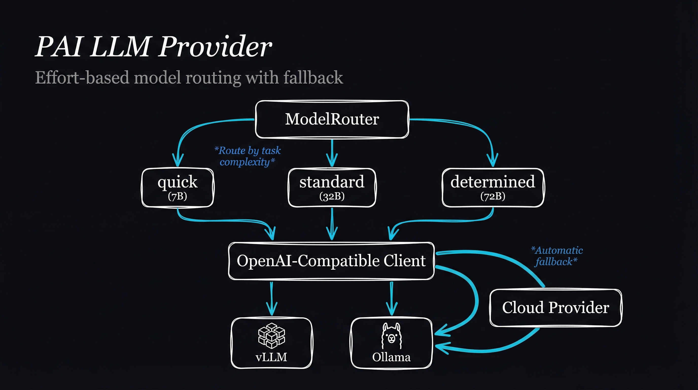

# pai-llm-provider

OpenAI-compatible LLM provider abstraction for PAI. Routes requests to appropriate models based on effort level with automatic fallback support.

## Architecture



```
┌─────────────────────────────────────────────────────────────┐
│                      ModelRouter                             │
│  ┌─────────────────────────────────────────────────────┐    │
│  │                 Effort Levels                        │    │
│  │  ┌──────────┐  ┌──────────┐  ┌──────────────┐      │    │
│  │  │  quick   │  │ standard │  │  determined  │      │    │
│  │  │  (7B)    │  │  (32B)   │  │    (72B)     │      │    │
│  │  └────┬─────┘  └────┬─────┘  └──────┬───────┘      │    │
│  └───────┼─────────────┼───────────────┼──────────────┘    │
│          │             │               │                    │
│          ▼             ▼               ▼                    │
│  ┌─────────────────────────────────────────────────────┐    │
│  │           OpenAI-Compatible Client                   │    │
│  │  • vLLM (self-hosted)                               │    │
│  │  • Ollama (local dev)                               │    │
│  │  • Any OpenAI-compatible API                        │    │
│  └─────────────────────────────────────────────────────┘    │
│                          │                                   │
│                          ▼ (fallback)                        │
│  ┌─────────────────────────────────────────────────────┐    │
│  │              Cloud Provider (optional)               │    │
│  │  • OpenAI, Anthropic, etc.                          │    │
│  └─────────────────────────────────────────────────────┘    │
└─────────────────────────────────────────────────────────────┘
```

## Installation

```bash
cd Packs/pai-llm-provider
bun install
```

## Usage

### Basic Usage

```typescript
import { ModelRouter, OLLAMA_CONFIG } from 'pai-llm-provider';

// For local development with Ollama
const router = new ModelRouter(OLLAMA_CONFIG);

// Simple completion
const response = await router.complete({
  messages: [{ role: 'user', content: 'Hello!' }],
  effort: 'quick',
});
```

### Streaming

```typescript
for await (const chunk of router.stream({
  messages: [{ role: 'user', content: 'Tell me a story' }],
  effort: 'standard',
})) {
  process.stdout.write(chunk.choices[0]?.delta.content ?? '');
}
```

### From Environment Variables

```typescript
import { createProvider } from 'pai-llm-provider';

const router = createProvider();
```

## Configuration

### Environment Variables

| Variable | Description | Default |
|----------|-------------|---------|
| `VLLM_ENDPOINT` / `LLM_ENDPOINT` | API endpoint URL | `http://vllm-service:8000/v1` |
| `VLLM_API_KEY` / `LLM_API_KEY` | Optional API key | - |
| `USE_OLLAMA` | Use Ollama backend | `false` |
| `OLLAMA_ENDPOINT` | Ollama endpoint | `http://localhost:11434/v1` |

### Effort Levels

| Level | Model Size | Use Case |
|-------|------------|----------|
| `quick` | 7B | Fast responses, simple tasks |
| `standard` | 32B | General purpose |
| `determined` | 72B | Complex reasoning, coding |

### Pre-built Configs

```typescript
import { DEFAULT_VLLM_CONFIG, OLLAMA_CONFIG } from 'pai-llm-provider';

// vLLM (production)
const vllmRouter = new ModelRouter(DEFAULT_VLLM_CONFIG);

// Ollama (development)
const ollamaRouter = new ModelRouter(OLLAMA_CONFIG);
```

## API Reference

### `ModelRouter`

| Method | Description |
|--------|-------------|
| `complete(request)` | Non-streaming completion |
| `stream(request)` | Streaming completion |
| `setEffort(level)` | Set default effort level |
| `getEffort()` | Get current effort level |
| `healthCheck()` | Check if any model available |
| `healthCheckAll()` | Check all configured models |
| `fromEnv()` | Create from environment variables |

### Types

```typescript
type EffortLevel = 'quick' | 'standard' | 'determined';

interface CompletionRequest {
  messages: ChatMessage[];
  tools?: Tool[];
  tool_choice?: 'auto' | 'none';
  effort?: EffortLevel;
  stream?: boolean;
}
```

## Integration with PAI

This pack provides the LLM foundation for:
- `pai-k8s-agent` - Agent runtime uses this for inference
- Custom PAI workflows requiring LLM calls
- Any component needing OpenAI-compatible chat completions
