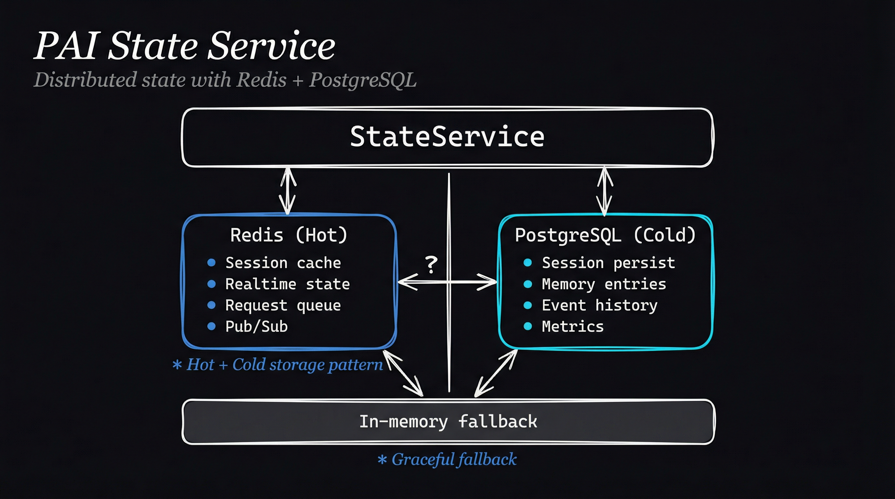

# pai-state-service

Distributed state management for PAI with Redis (real-time) and PostgreSQL (persistent) backends. Replaces file-based MEMORY system with scalable infrastructure.

## Architecture



```
┌─────────────────────────────────────────────────────────────┐
│                     StateService                             │
│                                                              │
│  ┌────────────────────┐    ┌────────────────────┐          │
│  │   Redis (Hot)      │    │  PostgreSQL (Cold) │          │
│  │                    │    │                    │          │
│  │  • Session cache   │    │  • Session persist │          │
│  │  • Realtime state  │    │  • Memory entries  │          │
│  │  • Request queue   │    │  • Event history   │          │
│  │  • Pub/Sub events  │    │  • Metrics storage │          │
│  │                    │    │                    │          │
│  │  TTL: configurable │    │  TTL: permanent    │          │
│  └────────────────────┘    └────────────────────┘          │
│           │                         │                       │
│           └─────────┬───────────────┘                       │
│                     │                                        │
│           ┌─────────▼─────────┐                             │
│           │  In-Memory        │                             │
│           │  Fallback         │                             │
│           │  (no deps mode)   │                             │
│           └───────────────────┘                             │
└─────────────────────────────────────────────────────────────┘
```

## Installation

```bash
cd Packs/pai-state-service
bun install
```

## Usage

### Basic Usage

```typescript
import { StateService } from 'pai-state-service';

// Create from environment variables
const state = StateService.fromEnv();
await state.connect();

// Create session
const session = await state.createSession('You are a helpful assistant.');

// Add message
await state.addMessage(session.id, {
  role: 'user',
  content: 'Hello!',
});

// Clean up
await state.disconnect();
```

### Realtime State

```typescript
// Update status (visible to observability)
await state.setStatus('processing', 'Handling user query');

// Get current state
const current = await state.getRealtimeState();
console.log(current.status); // 'processing'
```

### Event Logging

```typescript
// Log event (published to Redis + persisted to PostgreSQL)
await state.logEvent('query_completed', { tokens: 150 }, session.id);

// Subscribe to events
await state.subscribeEvents((event) => {
  console.log('Event:', event.type, event.data);
});

// Get recent events
const events = await state.getRecentEvents(100);
```

### Memory Storage

```typescript
// Save memory entry
const id = await state.saveMemory({
  type: 'learning',
  content: 'User prefers TypeScript over Python',
  tags: ['preference', 'language'],
});

// Search memory by type
const memories = await state.searchMemory('learning', 50);
```

### Metrics

```typescript
// Log metric
await state.logMetric('query_latency', 250, { model: 'qwen2.5-32b' });

// Get metrics for time range
const metrics = await state.getMetrics(
  'query_latency',
  new Date('2026-01-01'),
  new Date()
);
```

## Configuration

### Environment Variables

| Variable | Description | Default |
|----------|-------------|---------|
| `REDIS_URL` | Redis connection URL | - |
| `REDIS_PREFIX` | Key prefix | `pai:` |
| `DATABASE_URL` / `POSTGRES_URL` | PostgreSQL connection | - |

### Flexible Deployment

```typescript
// Redis only (real-time, no persistence)
const state = new StateService({
  redis: { url: 'redis://localhost:6379' }
});

// PostgreSQL only (persistence, no real-time)
const state = new StateService({
  postgres: { connectionString: 'postgresql://...' }
});

// Both (full features)
const state = new StateService({
  redis: { url: 'redis://localhost:6379' },
  postgres: { connectionString: 'postgresql://...' }
});

// Neither (in-memory fallback)
const state = new StateService({});
```

## API Reference

### Session Management

| Method | Description |
|--------|-------------|
| `createSession(systemPrompt?)` | Create new session |
| `getSession(id)` | Get session (Redis → PostgreSQL → memory) |
| `saveSession(session)` | Save to all backends |
| `addMessage(sessionId, message)` | Add message to session |
| `deleteSession(id)` | Delete from all backends |
| `listSessions(limit?)` | List session IDs |

### Realtime State

| Method | Description |
|--------|-------------|
| `getRealtimeState()` | Get current state |
| `updateRealtimeState(updates)` | Update state |
| `setStatus(status, task?)` | Set agent status |

### Events & Metrics

| Method | Description |
|--------|-------------|
| `logEvent(type, data, sessionId?)` | Log event |
| `subscribeEvents(callback)` | Subscribe to events |
| `getRecentEvents(limit?)` | Get recent events |
| `logMetric(kpiId, value, metadata?)` | Log metric |
| `getMetrics(kpiId, start, end)` | Get metrics range |

## Data Model

### Session
```typescript
interface SessionData {
  id: string;
  messages: MessageData[];
  metadata: Record<string, unknown>;
  createdAt: Date;
  updatedAt: Date;
}
```

### Realtime State
```typescript
interface RealtimeState {
  status: 'idle' | 'processing' | 'waiting' | 'error';
  currentTask?: string;
  lastActivity: Date;
  data: Record<string, unknown>;
}
```

## Integration with PAI

Replaces file-based storage:

| Current (Files) | New (StateService) |
|-----------------|-------------------|
| `MEMORY/sessions/*.json` | `createSession()` / `getSession()` |
| `MEMORY/State/*.json` | `getRealtimeState()` |
| `history/raw-outputs/*.jsonl` | `logEvent()` |
| `.current-session` | Redis key via `setStatus()` |
