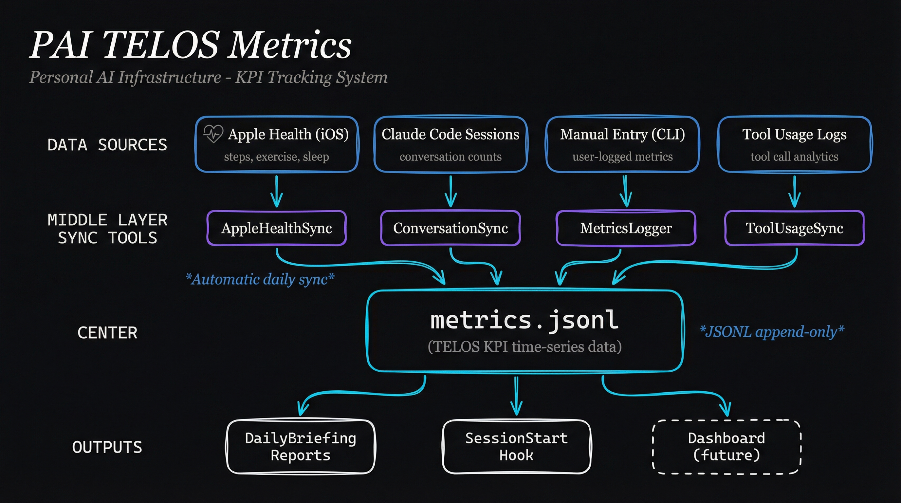

# pai-telos-metrics

Automated metrics tracking and KPI logging for TELOS goals with multi-source data collection.

## Architecture



```
┌─────────────────────────────────────────────────────────────────────────┐
│                         TELOS Metrics System                             │
│                                                                          │
│   ┌─────────────────────────────────────────────────────────────────┐   │
│   │                      Data Sources                                │   │
│   │                                                                  │   │
│   │   ┌──────────┐   ┌──────────┐   ┌──────────┐   ┌──────────┐   │   │
│   │   │  Apple   │   │  Claude  │   │  Manual  │   │   Tool   │   │   │
│   │   │  Health  │   │  Code    │   │  Entry   │   │  Usage   │   │   │
│   │   │  (iOS)   │   │ Sessions │   │  (CLI)   │   │  Logs    │   │   │
│   │   └────┬─────┘   └────┬─────┘   └────┬─────┘   └────┬─────┘   │   │
│   │        │              │              │              │          │   │
│   └────────┼──────────────┼──────────────┼──────────────┼──────────┘   │
│            │              │              │              │               │
│            ▼              ▼              ▼              ▼               │
│   ┌─────────────────────────────────────────────────────────────────┐   │
│   │                      Sync Tools                                  │   │
│   │                                                                  │   │
│   │   AppleHealthSync  ConversationSync  MetricsLogger  ToolUsageSync│   │
│   │                                                                  │   │
│   └─────────────────────────────────────────────────────────────────┘   │
│                              │                                          │
│                              ▼                                          │
│   ┌─────────────────────────────────────────────────────────────────┐   │
│   │                   metrics.jsonl                                  │   │
│   │              (TELOS KPI time-series data)                       │   │
│   └─────────────────────────────────────────────────────────────────┘   │
│                              │                                          │
│                              ▼                                          │
│   ┌──────────────────┐   ┌──────────────────┐   ┌──────────────────┐   │
│   │  DailyBriefing   │   │  SessionStart    │   │    Dashboard     │   │
│   │    Reports       │   │     Hook         │   │   (future)       │   │
│   └──────────────────┘   └──────────────────┘   └──────────────────┘   │
└─────────────────────────────────────────────────────────────────────────┘
```

## Overview

TELOS Metrics transforms your TELOS framework from a static document into a living accountability system. Define KPIs linked to your goals, track daily progress, and receive alignment briefings at each session start.

**Philosophy:** "Your manager is data." - Digital Self Management

## Features

- **TELOS Integration** - Parses your existing TELOS.md to understand goals
- **Multi-Source Collection** - Apple Health, Claude Code sessions, tool usage, manual entry
- **Auto-Sync** - Background sync from iOS, conversation logs, and tool analytics
- **Daily Briefings** - Automatic progress reports at session start
- **Streak Tracking** - Build consistency with streak milestones
- **Goal Alignment** - Link every metric to a TELOS goal

## Quick Start

```bash
# View daily briefing
bun run src/tools/DailyBriefing.ts

# Sync all data sources
bun run src/tools/AppleHealthSync.ts sync
bun run src/tools/ConversationSync.ts sync
bun run src/tools/ToolUsageSync.ts sync

# Log a metric manually
bun run src/tools/MetricsLogger.ts log --kpi pai_commits --value 5

# Check progress
bun run src/tools/MetricsLogger.ts status
```

## Structure

```
pai-telos-metrics/
├── SKILL.md                    # Skill definition for Claude
├── INSTALL.md                  # Installation instructions
├── README.md                   # This file
├── src/
│   └── tools/
│       ├── TelosParser.ts      # Parse TELOS.md
│       ├── MetricsLogger.ts    # Log and query KPIs
│       ├── DailyBriefing.ts    # Generate briefings
│       ├── AppleHealthSync.ts  # Sync iOS Health data
│       ├── ConversationSync.ts # Sync Claude session counts
│       └── ToolUsageSync.ts    # Sync tool usage analytics
├── data/
│   ├── kpi-config.yaml         # KPI definitions
│   └── metrics.jsonl           # Stored measurements
├── docs/
│   └── architecture.png        # Architecture diagram
└── hooks/
    └── telos-briefing.ts       # SessionStart hook
```

## Data Sources

### Apple Health Sync

Imports health metrics from iOS via an iCloud Shortcut export.

```bash
# Check sync status
bun run src/tools/AppleHealthSync.ts status

# Import health data
bun run src/tools/AppleHealthSync.ts sync

# Setup instructions
bun run src/tools/AppleHealthSync.ts setup
```

**Metrics synced:**
- `steps_count` - Daily step count
- `exercise_minutes` - Active exercise time
- `sleep_hours` - Sleep duration

**Setup:** Create an iOS Shortcut that exports HealthKit data to `iCloud Drive/PAI/health-sync.json`. Run `setup` command for detailed instructions.

### Conversation Sync

Counts Claude Code sessions from `~/.claude/projects/` by date.

```bash
# Sync conversation counts
bun run src/tools/ConversationSync.ts sync --days 7

# Show today's count
bun run src/tools/ConversationSync.ts today

# View history
bun run src/tools/ConversationSync.ts history --days 14
```

**Metrics synced:**
- `ai_conversations` - Number of Claude Code sessions per day

### Tool Usage Sync

Analyzes tool call patterns from conversation logs for workflow insights.

```bash
# Analyze tool usage
bun run src/tools/ToolUsageSync.ts analyze --days 7

# Sync to metrics
bun run src/tools/ToolUsageSync.ts sync --days 7

# Show underused tools
bun run src/tools/ToolUsageSync.ts underused

# Check diversity score
bun run src/tools/ToolUsageSync.ts diversity

# Show category definitions
bun run src/tools/ToolUsageSync.ts categories
```

**Metrics synced:**
| Category | KPI | Description |
|----------|-----|-------------|
| File Operations | `tool_file_ops` | Read, Write, Edit calls |
| Search | `tool_search` | Glob, Grep calls |
| Shell | `tool_shell` | Bash commands |
| Web | `tool_web` | WebSearch, WebFetch |
| Agents | `tool_agents` | Task delegation |
| Planning | `tool_planning` | TodoWrite, PlanMode |
| Testing | `dev_test` | Test commands |
| Building | `dev_build` | Build commands |
| Linting | `dev_lint` | Lint/typecheck |
| Git | `git_ops` | Git operations |
| Docs | `docs_edits` | Markdown file edits |
| Diversity | `tool_diversity` | % of available tools used |

### Manual Entry

Log metrics directly via CLI.

```bash
# Log a value
bun run src/tools/MetricsLogger.ts log --kpi <id> --value <n> [--note "..."]

# Today's entries
bun run src/tools/MetricsLogger.ts today

# Summary with trends
bun run src/tools/MetricsLogger.ts summary --days 7

# Current status
bun run src/tools/MetricsLogger.ts status

# Check streak
bun run src/tools/MetricsLogger.ts streak <kpi_id>

# List all KPIs
bun run src/tools/MetricsLogger.ts list
```

## Default KPIs

The pack includes sample KPIs linked to common TELOS goals:

| KPI | Goal | Target | Source |
|-----|------|--------|--------|
| `pai_commits` | G2: Enable software creation | 5/day | Manual |
| `deep_work_hours` | G2 | 4 hours/day | Manual |
| `ai_conversations` | G2 | 20/day | Auto (ConversationSync) |
| `content_published` | G1: Teach what's possible | 1/week | Manual |
| `exercise_minutes` | G3: Make time for exercise | 30 min/day | Auto (AppleHealth) |
| `steps_count` | G3 | 8,000/day | Auto (AppleHealth) |
| `sleep_hours` | - | 7 hours | Auto (AppleHealth) |
| `social_activities` | G4: Cultivate relationships | 2/week | Manual |
| `tool_diversity` | G2 | 60% | Auto (ToolUsageSync) |

Customize `data/kpi-config.yaml` to match your goals.

## Daily Briefing Format

```
## Daily Alignment Briefing - 2026-01-13

### Active Goals
- **G1:** Teach people what is possible with current and future technology
- **G2:** Enable anyone to create custom software

### KPI Progress
| KPI | Today | Target | 7-Day Avg | Streak | Status |
|-----|-------|--------|-----------|--------|--------|
| PAI Commits | 7 | 5 | 4.3 | 5d | On Track |
| AI Conversations | 23 | 20 | 18.2 | 4d | On Track |
| Deep Work Hours | 3 | 4 | 3.2 | 2d | Below |

### Focus Suggestions
- **Deep Work Hours** is at 3/4. Consider blocking focused time.
```

## Configuration

### kpi-config.yaml

```yaml
kpis:
  - id: commits_per_day
    name: Daily Commits
    description: Git commits made
    goal_ref: G2          # Links to TELOS Goal
    type: counter         # counter, duration, boolean, rating
    target: 5
    frequency: daily      # daily or weekly
    unit: commits
    auto_sync: false      # true for auto-collected metrics

streaks:
  enabled: true
  milestones: [3, 7, 14, 30, 60, 90]
  celebration_messages:
    7: "One week streak! Habits forming."
    30: "30 days! This is who you are now."
```

### KPI Types

- **counter** - Discrete events (commits, sessions, steps)
- **duration** - Time tracked (hours, minutes)
- **boolean** - Yes/no daily tracking
- **rating** - 1-10 subjective scale or percentage

## CLI Reference

### TelosParser

```bash
# Summary view
bun run src/tools/TelosParser.ts

# JSON output
bun run src/tools/TelosParser.ts --json

# Specific section
bun run src/tools/TelosParser.ts --section=goals
```

### DailyBriefing

```bash
# Full briefing
bun run src/tools/DailyBriefing.ts

# Compact (for hooks)
bun run src/tools/DailyBriefing.ts --compact

# JSON format
bun run src/tools/DailyBriefing.ts --json
```

## Management Script

A convenience script for common operations:

```bash
# Full sync of all data sources
./manage.sh sync

# Show dashboard summary
./manage.sh status

# Run daily briefing
./manage.sh brief
```

## Installation

See [INSTALL.md](./INSTALL.md) for detailed setup instructions.

## Related

- **TELOS.md** - Your life operating system (`$PAI_DIR/skills/CORE/USER/TELOS.md`)
- **pai-observability-server** - Real-time event streaming (future dashboard integration)

## License

Part of Personal AI Infrastructure (PAI).
