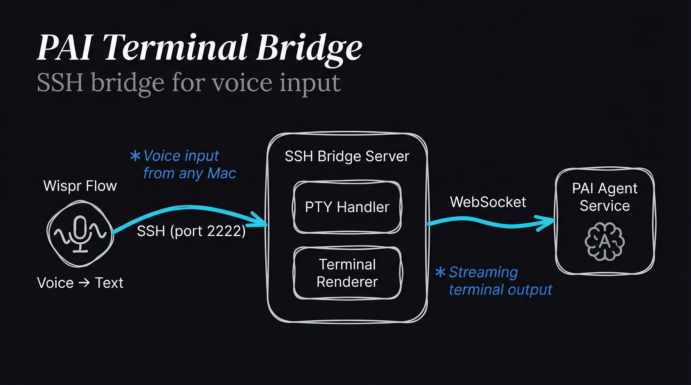

# pai-terminal-bridge

SSH-based terminal bridge for Wispr Flow to PAI Agent communication. Provides a PTY interface that captures voice input and forwards to the agent with streaming responses.

## Architecture



```
┌─────────────────────────────────────────────────────────────┐
│                                                              │
│   ┌──────────────┐                                          │
│   │  Wispr Flow  │  Voice → Text                            │
│   │  (any Mac)   │                                          │
│   └──────┬───────┘                                          │
│          │ SSH (port 2222)                                  │
│          ▼                                                  │
│   ┌─────────────────────────────────────────────┐          │
│   │           SSH Bridge Server                  │          │
│   │                                              │          │
│   │   ┌──────────────────────────────────────┐  │          │
│   │   │         PTY Handler                   │  │          │
│   │   │   • Input buffering                   │  │          │
│   │   │   • Special key handling (Ctrl+C/D)   │  │          │
│   │   │   • Command parsing (help, clear)     │  │          │
│   │   └──────────────────────────────────────┘  │          │
│   │                    │                         │          │
│   │                    ▼                         │          │
│   │   ┌──────────────────────────────────────┐  │          │
│   │   │        Terminal Renderer              │  │          │
│   │   │   • ANSI color formatting             │  │          │
│   │   │   • Tool call visualization           │  │          │
│   │   │   • Streaming output                  │  │          │
│   │   └──────────────────────────────────────┘  │          │
│   │                    │                         │          │
│   └────────────────────┼─────────────────────────┘          │
│                        │ WebSocket                           │
│                        ▼                                     │
│   ┌─────────────────────────────────────────────┐          │
│   │              PAI Agent Service               │          │
│   │          (pai-k8s-agent:8080)               │          │
│   └─────────────────────────────────────────────┘          │
│                                                              │
└─────────────────────────────────────────────────────────────┘
```

## Installation

```bash
cd Packs/pai-terminal-bridge
bun install

# Generate SSH host keys (required)
bun run generate-keys
```

## Usage

### Starting the Bridge

```bash
# Set agent URL and start
PAI_AGENT_URL=ws://localhost:8080 bun run start
```

### Connecting

```bash
# From any Mac with Wispr Flow
ssh -p 2222 pai@localhost

# Or with custom user
ssh -p 2222 benjamin@hostname
```

### Commands

Once connected:

| Command | Description |
|---------|-------------|
| `help` | Show help message |
| `clear` | Clear the screen |
| `exit` / `quit` | Disconnect |
| `Ctrl+C` | Interrupt / Exit |
| `Ctrl+D` | Disconnect |

## Configuration

### Environment Variables

| Variable | Description | Default |
|----------|-------------|---------|
| `SSH_PORT` | SSH server port | `2222` |
| `PAI_AGENT_URL` | Agent WebSocket URL | `ws://localhost:8080` |
| `HOST_KEY_PATH` | Path to SSH host key | `./keys/host_key` |
| `ALLOWED_USERS` | Comma-separated allowed usernames | (all) |
| `SESSION_TIMEOUT` | Session timeout in ms | `3600000` (1 hour) |

### Programmatic Configuration

```typescript
import { SSHBridgeServer } from 'pai-terminal-bridge';

const server = new SSHBridgeServer({
  sshPort: 2222,
  agentUrl: 'ws://pai-agent:8080',
  hostKeyPath: '/path/to/host_key',
  allowedUsers: ['benjamin', 'guest'],
  sessionTimeout: 3600000,
});

await server.start();
```

## Components

### SSHBridgeServer

Main SSH server handling connections:

```typescript
const server = new SSHBridgeServer(config);

// Start listening
await server.start();

// Get active sessions
console.log(`Active: ${server.getSessionCount()}`);

// Stop server
server.stop();
```

### AgentClient

WebSocket client for PAI Agent communication:

```typescript
import { AgentClient } from 'pai-terminal-bridge';

const client = new AgentClient({
  url: 'ws://localhost:8080',
  onMessage: (msg) => console.log(msg),
  onError: (err) => console.error(err),
  onClose: () => console.log('Disconnected'),
});

await client.connect();
client.send('Hello, Aurelia!');
```

### TerminalRenderer

Formats agent responses for terminal display:

```typescript
import { TerminalRenderer } from 'pai-terminal-bridge';

const renderer = new TerminalRenderer();

// Render different message types
renderer.render({ type: 'chunk', content: 'Hello!' });
renderer.render({ type: 'tool_call', toolCall: { name: 'read_file' } });
renderer.render({ type: 'tool_result', toolResult: { result: '...' } });

// Get UI elements
renderer.getWelcome(sessionId);
renderer.getPrompt();
renderer.getClearScreen();
```

## Key Generation

> **SECURITY WARNING**: SSH keys should NEVER be committed to git. The `keys/` directory is gitignored. Generate keys at deploy time and store in a secret manager.

```bash
# Generate new host keys (local development only)
bun run generate-keys

# Keys are stored in ./keys/ (gitignored)
ls keys/
# host_key      (private key - NEVER COMMIT)
# host_key.pub  (public key)
```

### Kubernetes Deployment

For production, create a K8s secret:

```bash
# Generate key
ssh-keygen -t rsa -b 4096 -f /tmp/host_key -N ""

# Create secret
kubectl create secret generic pai-terminal-bridge-host-key \
  --from-file=host_key=/tmp/host_key \
  --from-file=host_key.pub=/tmp/host_key.pub

# Clean up local copy
rm /tmp/host_key /tmp/host_key.pub
```

The deployment mounts this secret at `/etc/ssh/host_key`.

## Security Considerations

- **Host Keys**: NEVER commit to git. Generate at deploy time, store in K8s secrets or vault
- **User Auth**: Currently accepts all auth methods; implement proper auth for production
- **Allowed Users**: Use `ALLOWED_USERS` to restrict access
- **Network**: Bind to specific interface if needed (default: `0.0.0.0`)

## Integration with PAI

This bridge enables:
- **Wispr Flow voice input** from any Mac
- **Remote PAI access** via standard SSH
- **Terminal-based interaction** with streaming responses
- **Session persistence** through agent session IDs

### Typical Deployment

```
Mac (Wispr Flow) ─── SSH ───▶ Terminal Bridge ─── WS ───▶ PAI Agent
                              (port 2222)                (port 8080)
```

## Testing

```bash
# Start with mock agent
bun run test/integration-test.ts

# Manual test
ssh -p 2222 pai@localhost
> Hello, Aurelia!
```
