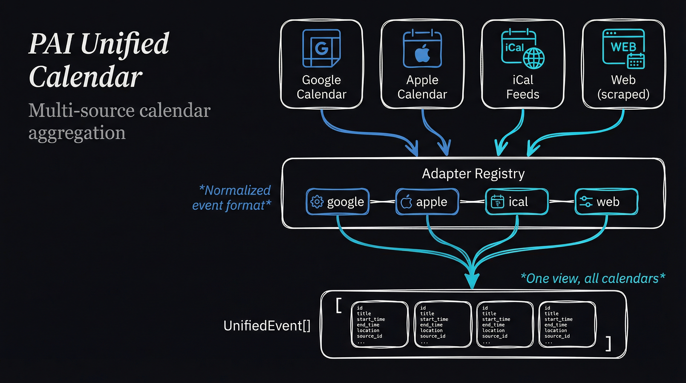

# pai-unified-calendar

Unified calendar aggregation for PAI. Fetches events from multiple sources (Google Calendar, Apple Calendar, iCal feeds, web calendars) into a single normalized view.

## Architecture



```
┌─────────────────────────────────────────────────────────────┐
│                  Unified Calendar System                     │
│                                                              │
│   ┌─────────────────────────────────────────────────────┐   │
│   │                  Calendar Sources                    │   │
│   │                                                      │   │
│   │   ┌──────────┐  ┌──────────┐  ┌──────────┐        │   │
│   │   │  Google  │  │  Apple   │  │   iCal   │        │   │
│   │   │ Calendar │  │ Calendar │  │  Feeds   │        │   │
│   │   └────┬─────┘  └────┬─────┘  └────┬─────┘        │   │
│   │        │             │             │               │   │
│   │   ┌────┴─────────────┴─────────────┴────┐         │   │
│   │   │                                      │         │   │
│   │   │         ┌──────────┐                │         │   │
│   │   │         │   Web    │                │         │   │
│   │   │         │Calendars │                │         │   │
│   │   │         │(scraped) │                │         │   │
│   │   │         └────┬─────┘                │         │   │
│   │   │              │                       │         │   │
│   │   └──────────────┼───────────────────────┘         │   │
│   └──────────────────┼───────────────────────────────────┘   │
│                      ▼                                       │
│   ┌─────────────────────────────────────────────────────┐   │
│   │              Adapter Registry                        │   │
│   │   ┌─────────┐ ┌─────────┐ ┌─────────┐ ┌─────────┐  │   │
│   │   │ google  │ │ apple   │ │  ical   │ │  web    │  │   │
│   │   │ adapter │ │ adapter │ │ adapter │ │ adapter │  │   │
│   │   └────┬────┘ └────┬────┘ └────┬────┘ └────┬────┘  │   │
│   └────────┼───────────┼───────────┼───────────┼────────┘   │
│            │           │           │           │             │
│            └───────────┴───────────┴───────────┘             │
│                              │                               │
│                              ▼                               │
│   ┌─────────────────────────────────────────────────────┐   │
│   │                 UnifiedEvent[]                       │   │
│   │   • Normalized structure                             │   │
│   │   • Sorted by start date                            │   │
│   │   • Source attribution                              │   │
│   └─────────────────────────────────────────────────────┘   │
└─────────────────────────────────────────────────────────────┘
```

## Installation

```bash
cd Packs/pai-unified-calendar
bun install
```

## Configuration

Create `calendar-sources.yaml` in your config directory:

```yaml
sources:
  # Google Calendar
  - type: google
    label: "Work"
    account: work@example.com
    enabled: true

  - type: google
    label: "Personal"
    account: personal@gmail.com
    calendarId: primary

  # Apple Calendar (via AppleScript)
  - type: apple
    label: "Apple Calendar"
    calendars:
      - "Home"
      - "Family"

  # iCal feeds
  - type: ical
    label: "Holidays"
    url: "https://calendar.google.com/calendar/ical/en.usa%23holiday%40group/public/basic.ics"
    refreshInterval: "24h"

  # Web calendars (scraped)
  - type: web
    label: "Dance Events"
    url: "https://example.com/events"
    parser: bandzoogle
    calendarId: "1083094"
    monthsAhead: 3

defaults:
  days: 14
  refreshInterval: "1h"
```

## Usage

### CLI

```bash
# List all events for next 7 days
bun run cli/index.ts list

# List events for next 14 days
bun run cli/index.ts list --days 14

# Show events from specific source
bun run cli/index.ts list --source "Work"

# Output as JSON
bun run cli/index.ts list --json
```

### Programmatic

```typescript
import { fetchAllEvents, fetchEventsBySource } from 'pai-unified-calendar';

const config = loadConfig('calendar-sources.yaml');

// Fetch all events
const events = await fetchAllEvents(config, { days: 14 });

events.forEach(event => {
  console.log(`${event.start}: ${event.title} (${event.source.label})`);
});

// Fetch grouped by source
const bySource = await fetchEventsBySource(config, { days: 7 });

bySource.forEach((events, source) => {
  console.log(`\n${source}:`);
  events.forEach(e => console.log(`  - ${e.title}`));
});
```

### MCP Server

```bash
# Start MCP server
bun run mcp/server.ts
```

MCP Tools available:
- `calendar_list_events` - List events with optional date range
- `calendar_search` - Search events by title/description
- `calendar_sources` - List configured sources

## Source Types

### Google Calendar

```yaml
- type: google
  label: "Work Calendar"
  account: user@example.com
  calendarId: primary  # or specific calendar ID
```

Requires OAuth setup via `pai-google-workspace`.

### Apple Calendar

```yaml
- type: apple
  label: "Mac Calendar"
  calendars:
    - "Home"
    - "Work"
```

Uses AppleScript, requires macOS and calendar access permissions.

### iCal Feeds

```yaml
- type: ical
  label: "Public Holidays"
  url: "https://example.com/calendar.ics"
  refreshInterval: "24h"
```

Supports any standard `.ics` feed URL.

### Web Calendars

```yaml
- type: web
  label: "Event Website"
  url: "https://example.com/events"
  parser: auto  # or 'bandzoogle', 'eventbrite', 'custom'
  selectors:    # for custom parser
    eventContainer: ".event-item"
    title: ".event-title"
    date: ".event-date"
```

Scrapes event data from web pages with built-in parsers.

## Data Model

### UnifiedEvent

```typescript
interface UnifiedEvent {
  id: string;
  title: string;
  start: Date;
  end: Date;
  allDay: boolean;
  location?: string;
  description?: string;
  source: {
    type: 'google' | 'apple' | 'ical' | 'web';
    label: string;
    account?: string;
  };
  url?: string;
  raw?: unknown;  // Original event data
}
```

## Adapters

Each source type has a dedicated adapter:

| Adapter | Source Type | Dependencies |
|---------|-------------|--------------|
| `googleAdapter` | Google Calendar | OAuth tokens via pai-google-workspace |
| `appleAdapter` | Apple Calendar | macOS, AppleScript |
| `icalAdapter` | iCal feeds | Network access |
| `webAdapter` | Web pages | Playwright for JS-rendered sites |

### Custom Adapter

```typescript
import type { CalendarAdapter, UnifiedEvent } from 'pai-unified-calendar';

const customAdapter: CalendarAdapter = {
  type: 'custom',
  async getEvents(source, startDate, endDate) {
    // Fetch and normalize events
    return events.map(e => ({
      id: e.id,
      title: e.name,
      start: new Date(e.start),
      end: new Date(e.end),
      allDay: false,
      source: { type: 'custom', label: source.label },
    }));
  },
};
```

## Integration with PAI

This pack enables:
- **Morning briefings** with today's schedule
- **Proactive reminders** before events
- **Calendar search** via natural language
- **Multi-source aggregation** for complete view

### Example PAI Query

```
User: "What's on my calendar this week?"

Aurelia: Here's your schedule for the week:

**Monday**
- 9:00 AM: Team standup (Work)
- 2:00 PM: Dentist appointment (Personal)

**Tuesday**
- 10:00 AM: Project review (Work)
- 7:00 PM: Salsa class (Dance Events)
...
```
